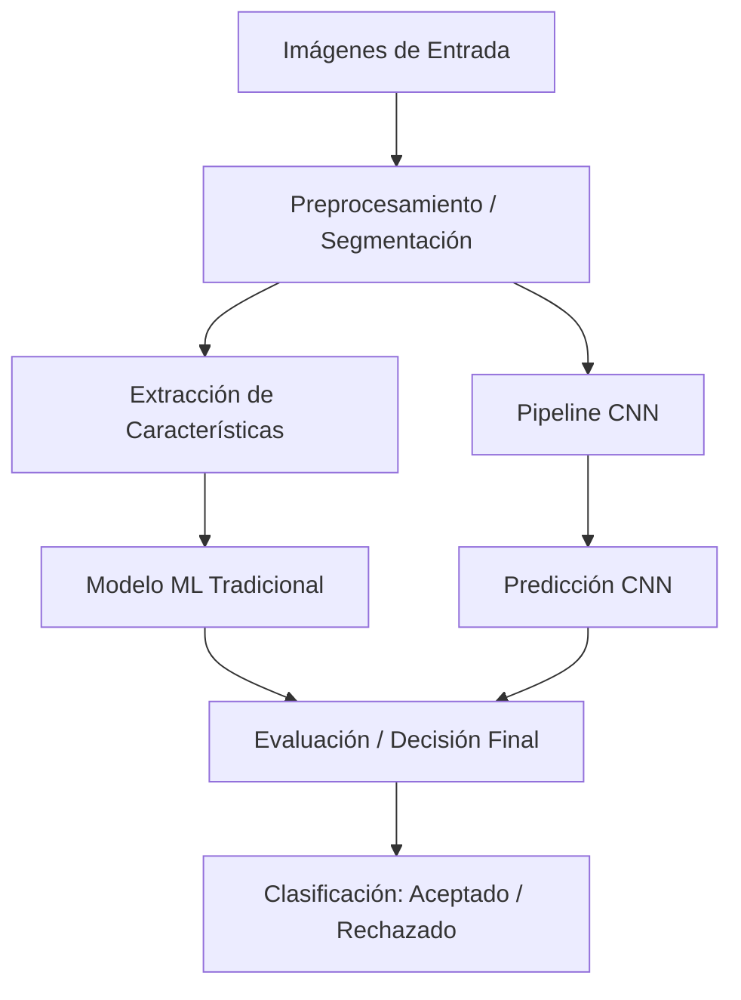

# Arquitectura del Modelo y Diseño

Este documento describe la arquitectura del sistema **AgroVision-QC-Pipeline** para el control de calidad automatizado de frutas. El pipeline se basa en la metodología estándar **CRISP-DM** (Cross-Industry Standard Process for Data Mining).

## 1. Fases del Proceso CRISP-DM

- **Comprensión del Negocio**: Definición del problema de control de calidad, tolerancias de imperfecciones en la fruta y objetivos del negocio (reducción de falsos positivos y falsos negativos).
- **Comprensión de los Datos**: Exploración del dataset de imágenes de frutas, balance de clases, variabilidad de iluminación y calidad del etiquetado.
- **Preparación de los Datos**: Operaciones de pipeline de preprocesamiento (escalado, rotación, normalización de color, aumentación de datos).
- **Modelado**: Implementación de algoritmos de clasificación tradicionales (p. ej., SVM, Random Forest con descriptores de color y textura) y modelos de aprendizaje profundo (p. ej., redes neuronales convolucionales - CNN personalizadas y transfer learning).
- **Evaluación**: Comparación de rendimiento mediante métricas estándar (Accuracy, Precision, Recall, F1-Score) y validación cruzada.
- **Despliegue**: Integración y ejecución del pipeline end-to-end.

## 2. Diagrama del Pipeline de Datos

El flujo de procesamiento de imágenes y predicción sigue los siguientes pasos:

## 3. Arquitectura del Modelo CNN

La red neuronal convolucional (CNN) utilizada sigue la estructura clásica:
- **Capa de Entrada**: Imágenes redimensionadas con normalización de canal de color.
- **Bloques Convolucionales**: Capas `Conv2D` seguidas de `BatchNormalization`, activación `ReLU` y capas de submuestreo `MaxPooling2D`.
- **Capas Densas**: Capa de aplanamiento (`Flatten`), seguida de capas completamente conectadas (`Dense`) con regularización `Dropout` para evitar el sobreajuste.
- **Capa de Salida**: Activación `Sigmoid` (clasificación binaria) o `Softmax` (clasificación multiclase) para la predicción de calidad de la fruta.
